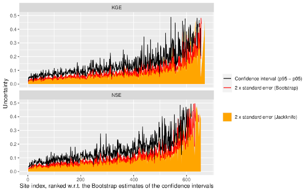

```{r setup, include = FALSE}
knitr::opts_chunk$set(
  collapse = TRUE,
  comment = "#>"
)
library(gumboot)
```

Clark et al. (2021) have shown how Goodness of Fit (GOF) statistics for
hydrological models can easily be misused. The purpose of `gumboot` is to
evaluate the sampling uncertainty in GOF statistics using both jacknife and 
bootstrap methods.

## Theory
The sampling uncertainty in the GOF estimates is quantified using a mixture of Jackknife and Bootstrap methods. First, we use the Jackknife and Bootstrap methods to compute the standard error in the GOF estimates. These methods resample from the original data sample using the Non-overlapping Block Bootstrap (NBB) strategy using data blocks of length one year. The use of data blocks of length one year reduces the issues with substantial seasonal nonstationarity in shorter data blocks, while preserving the within-year autocorrelation and seasonal periodicity of streamflow series. Bootstrapping methods are only effective if the blocks used are approximately independent. Second, we use the Bootstrap methods to compute tolerance intervals for the GOF estimates, where the 90% tolerance intervals are defined as the difference between the 95th and 5th percentile of the empirical probability distribution of the GOF estimates.  Tolerance intervals differ from confidence intervals, because tolerance intervals are intervals corresponding to a random variable, rather than random confidence intervals around some true value. These bootstrap tolerance intervals are computed using 1000 bootstrap samples. Finally, we use the Jackknife-After-Bootstrap method (Efron, 1992) to estimate the standard error in the Bootstrap tolerance intervals, which enables us to evaluate how sensitive the resulting uncertainty intervals are to individual years (blocks). 

References:
Efron, B. and Gong, G., 1983. A leisurely look at the bootstrap, the jackknife, and cross-validation. The American Statistician, 37(1), pp.36-48.

Efron, B., 1992. Jackknife‐after‐bootstrap standard errors and influence functions. Journal of the Royal Statistical Society: Series B (Methodological), 54(1), pp.83-111.

## How to use `gumboot`
The most important function is `bootjack()` which computes the bootstap and jackknife statistics
for a single data set, which is a data frame containing dates, observed
and simulated flows.

A data set (`flows_1030500`) is provided.
```{r}
flows_1030500 <- flows_1030500 
head(flows_1030500)
```

Plotting the values shows fairly good agreement between the simulated and observed values  

```{r, fig.width = 5}
library(ggplot2)
library(reshape2)
melted <- melt(flows_1030500, id.vars = "date")
ggplot(melted, aes(date, value, colour = variable)) +
  geom_line() +
  xlab("") +
  labs(y = bquote('Daily streamflow'~(m^3/s)), x = "")
```

To perform the bootstrap and jackknife analyses, the values are 
passed to `bootjack`. There are many options.
The default is to calculate statistics for both NSE (Nash-Sutcliffe efficiency), and
KGE (Kling-Gupta efficiency) values. In this example, we will compute the
statistics of the NSE.  

Note that the name of the observed variable must be `obs` and the name
of the simulated variable must be `sim`.

```{r}
NSE_values <- bootjack(flows_1030500, GOF_stat = "NSE")
NSE_values
```
In this example, the standard error of the NSE statistic, as calculated by jackknifing is `r NSE_values$seJack[1]`; as calculated by bootstrapping it is `r NSE_values$seBoot[1]`, and as calculated
by jackknifing after the bootstrapping (JAB) is `r NSE_values$seJab[1]`, showing the uncertainty
in the statistic.  

It is important to note that the bootstrap and jackknife-after-bootstrap standard errors are dependant
on random samples of the years, so the values will change with each execution of the function.
If you want to get the same values each time, for example to compare your results with
another person's analyses, you have two options.

If you set the option `seed` to have a value, the **R** random number generator will always
return the same sequence of values, as shown below:  

```{r}
bootjack(flows_1030500, GOF_stat = "NSE", seed = 1)
bootjack(flows_1030500, GOF_stat = "NSE", seed = 1)
```

Note that the value of `seJack` above is identical to the previously determined value,
as the jackknifing always uses the same set of years of data.


If you want to compare the results with code not written in **R** you can save the randomly selected
years to a file. If the specified file does not exist, it will be written to. If
the file does exist, then the years will be read from it. 

### Raw values
If you are interested in the values used to calculate the standard errors, you can return them
using the option `returnSamples = TRUE`. The function returns a list with the values
for the bootstrap and jackknifing analyses.

```{r}
NSE_samples <- bootjack(flows_1030500, GOF_stat = "NSE", returnSamples = TRUE)
names(NSE_samples)
```

You can see the variability of the NSE values (as well as the sampled observed and 
simulated values) as determined by the bootstrap and jackknife.

```{r, fig.width=5, warning=FALSE, message = FALSE, error=FALSE}
ggplot(NSE_samples$statsBoot, aes(NSE)) + 
  geom_histogram() +
  ggtitle("Bootstrap samples")
```


## Multiple locations

The function `CAMELS_bootjack()` applies `bootjack()` to model runs over the
"CAMELS" catchments across the contiguous US (CONUS). The model runs are not supplied, and need to
be stored in a NetCDF file.

Newman et al. (2015) and Addor et al. (2017) provide details on the hydrometeorological and physiographical characteristics of the CAMELS catchments. The CAMELS catchments are those with minimal human disturbance (i.e., minimal land use changes or disturbances, minimal water withdrawals), and are hence almost exclusively smaller, headwater-type catchments (median basin size of 336 km^2^).

References:
Addor, N., Newman, A.J., Mizukami, N. and Clark, M.P., 2017. The CAMELS data set: catchment attributes and meteorology for large-sample studies. Hydrology and Earth System Sciences, 21(10), pp.5293-5313.

Newman, A.J., Clark, M.P., Sampson, K., Wood, A., Hay, L.E., Bock, A., Viger, R.J., Blodgett, D., Brekke, L., Arnold, J.R. and Hopson, T., 2015. Development of a large-sample watershed-scale hydrometeorological data set for the contiguous USA: data set characteristics and assessment of regional variability in hydrologic model performance. Hydrology and Earth System Sciences, 19(1), p.209.

In addition to the NetCDF file containing the model runs `CAMELS_bootjack()` a
data frame containing the site numbers and their latitudes and longitudes. This
is contained in the supplied data frame `CAMELS_sites`. Note that you can subset
the data frame if you only wish to test some of the runs.

`CAMELS_bootjack()` has most of the same options as `bootjack()` and returns
the same values. Unless you tell it not to (setting `quiet = TRUE`) a progress
bar will be displayed. 

This example does the analyses for all of the CAMELS data, returning statistics
for runs which were optimised using NSE and KGE run targets, using both NSE and KGE 
goodness of fit statistics.

```{r, eval = FALSE}
CAMELS_sites <- hcdn_conus_sites
nc_file <- "/home/kevin/data/projects/bootstrappR_test/hess2019/results_hcdn_flow.nc"
CAMELS_stats <- CAMELS_bootjack(CAMELS_sites, nc_file)
```
Having computed the statistics for all CAMELS basins, the uncertainties in the
NSE and KGE values can be plotted using `ggplot_estimate_uncertainties()`, which
returns a **ggplot2** plot object. 

Because some of the CAMELS basins have data sets which do not meet the default
criteria for `bootjack()`, they will return `NA_real_` values for their
statistics. It is a good idea to first remove these stations from the data set before
calling `ggplot_estimate_uncertainties()`, by using `na.omit()`.

```{r, eval = FALSE}
CAMELS_stats_cleaned <- na.omit(CAMELS_stats)
ggplot_estimate_uncertainties(CAMELS_stats_cleaned, fill_colour = "orange")
```



